 A comprehensive web application that enables users to estimate solar energy generation and visualize financial and environmental benefits for their homes based on user location and roof area all through an intuitive interface and robust backend.

🚀 Features :
1. Solar Potential Analysis: Predict solar energy output for next 30 days , 12 months and an yearly aggreagate for any location based on roof area and real time weather parameters.
2. ML Model: The energy generation potential is predicted using ML model (XGBoost) trained on NSRDB dataset. 
3. Financial & Environmental Insights: Visualize cost savings and environmental impact by telling users their savings on current bill based on their potential of solar energy production and the amount they can earn by reselling to the government based on state specific policies and tariff rates.
4. Real time Weather data: Allows user to fetch the next 5 days real time weather data to be used in ML model predictions.
5. AI-Powered Chatbot: Get instant answers to solar-related queries.
6. Interactive Maps: Explore solar data across Indian states.
7. User Authentication: Secure login and personalized dashboard.
8. Report Saving: Allows users to save their energy and financial reports and download them or delete them . 
9. Reviews: Allows user to give a review on the website.

🖼️ Screenshots

  

    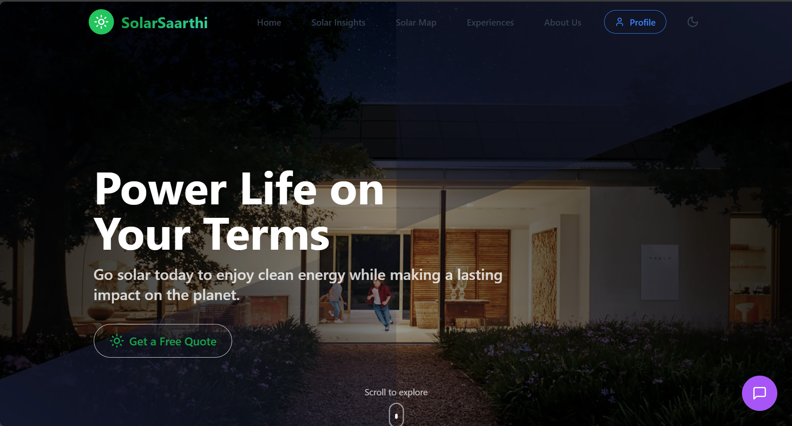
     
    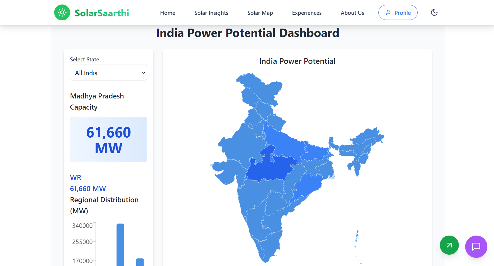
     
    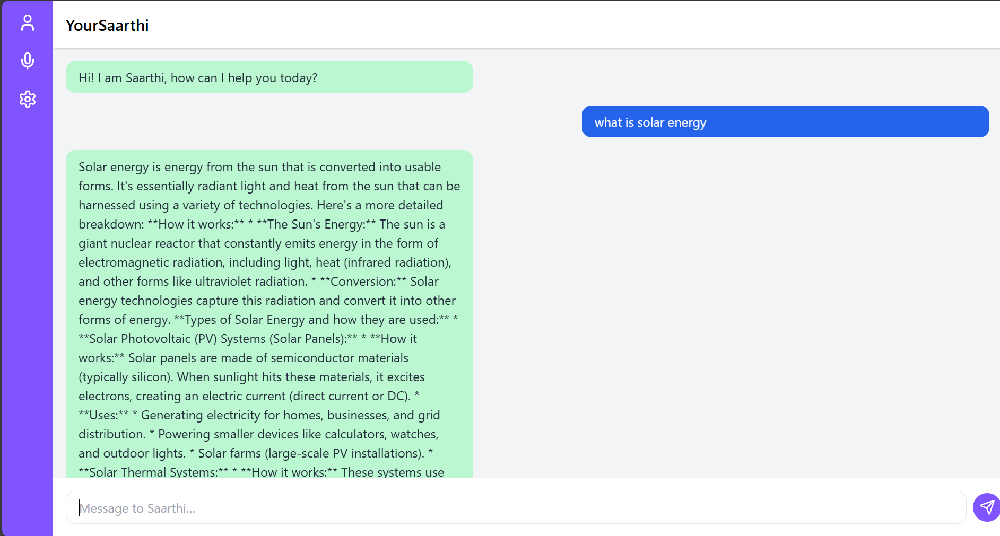
     
    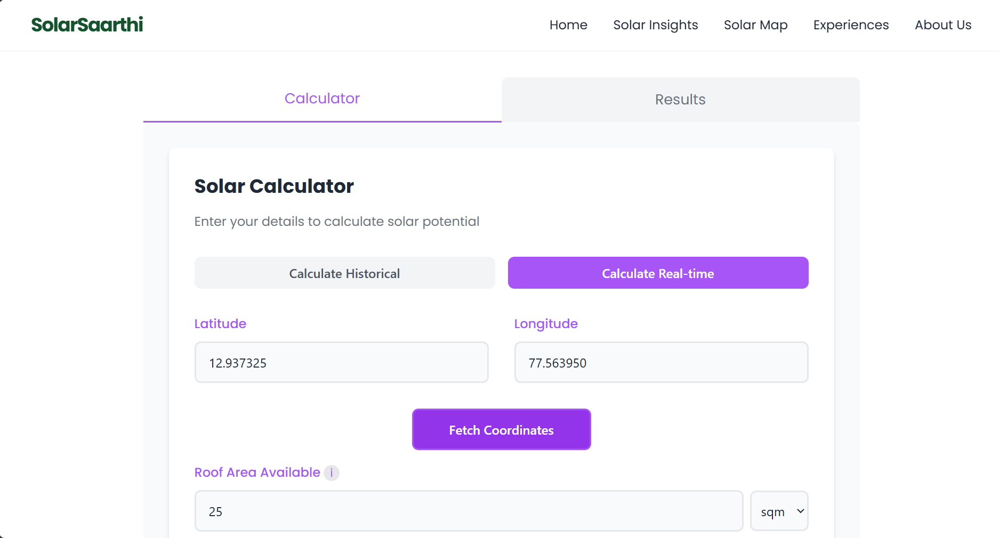
     
    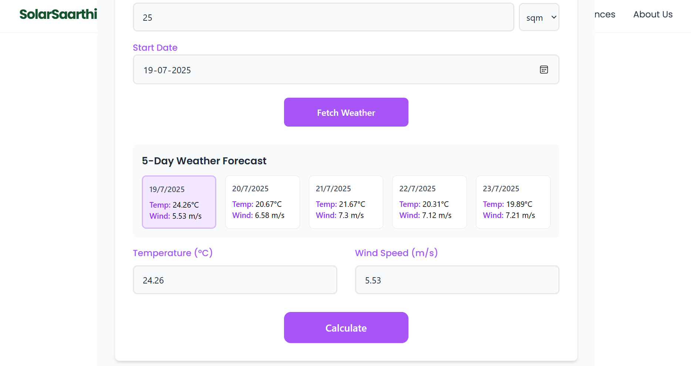
     
    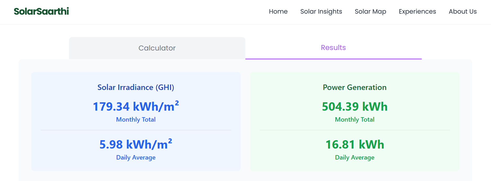
     
    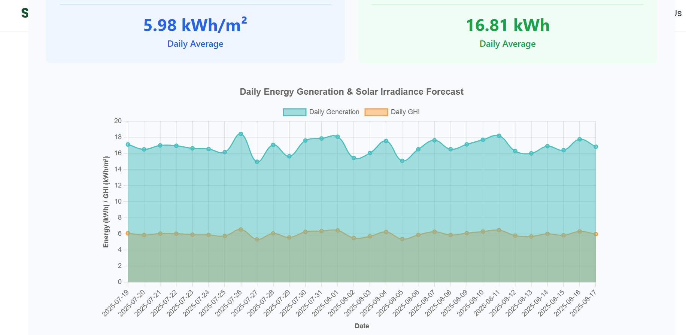
     
    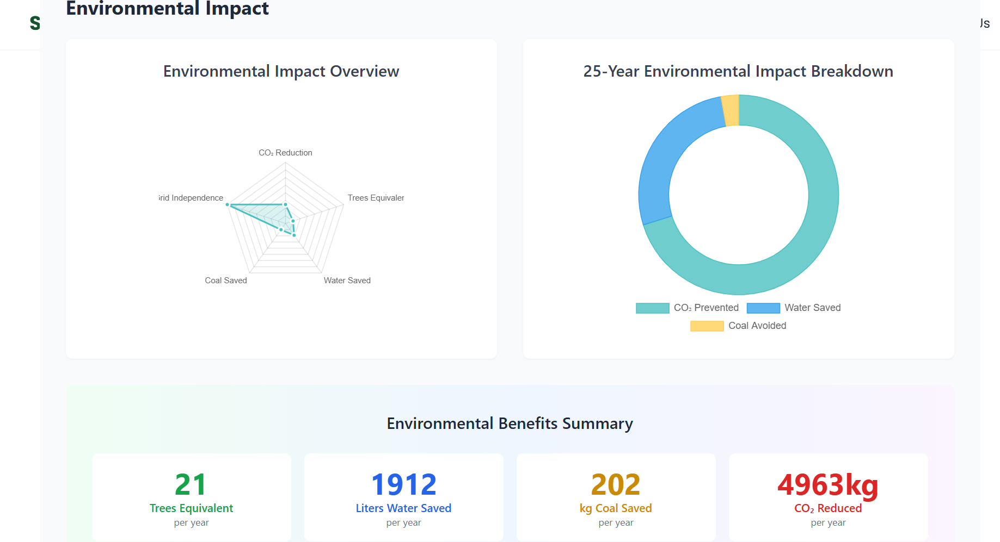
     
    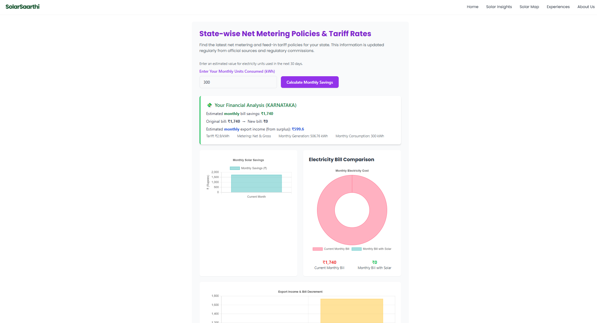
     
    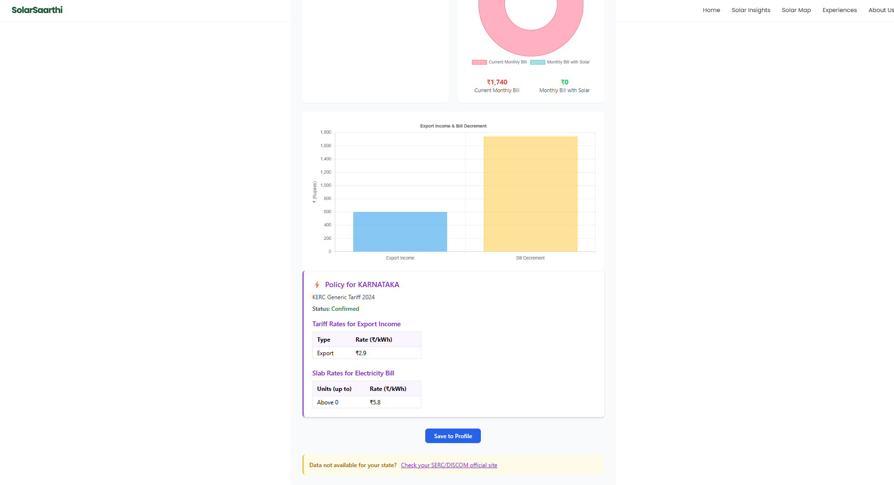
     
    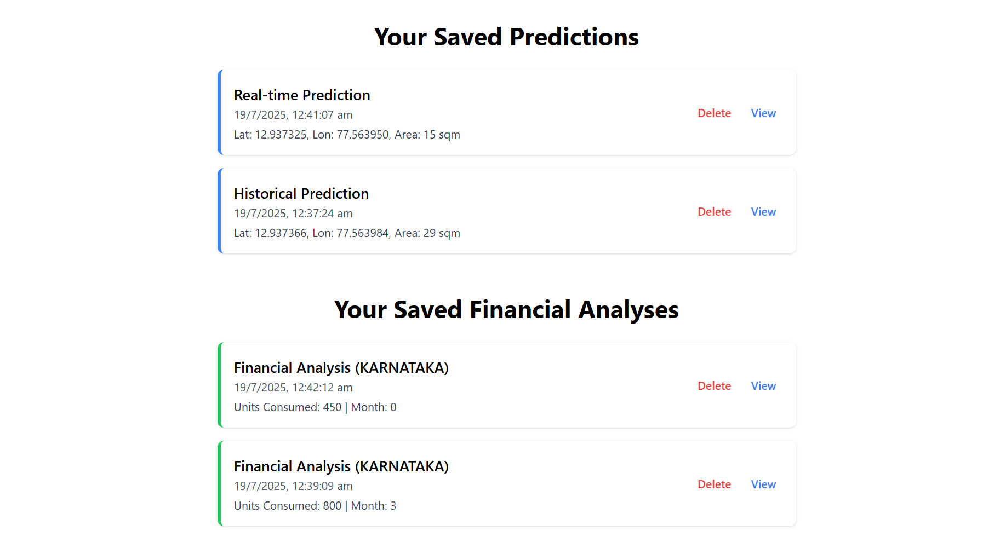
  

  
🛠️ **Tech Stack**

**Frontend**  
React.js  
Tailwind CSS  
React Router  
Axios  
Chart.js  
jsPDF  
html2canvas  

**Backend**  
FastAPI  
Python  
XGBoost  
Pydantic  
joblib  
scikit-learn  

**Database**  
Supabase (PostgreSQL)  

**APIs**  
OpenWeather API  
Google Gemini API  

**ML Model**  
XGBoost Regression Model
